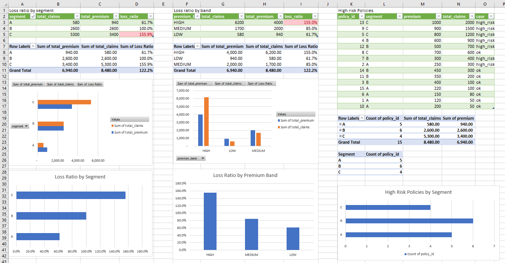

# Insurance Portfolio Analysis

This project analyses an insurance portfolio to identify unprofitable 
segments, high-risk premium bands and problematic individual policies.

Using SQL and Excel, I investigated three core pricing questions:
which segments are losing money, which premium bands carry the highest 
risk, and which individual policies should be flagged for review.

## What I looked at
- Loss ratio by customer segment
- Loss ratio by premium band
- High-risk individual policies

## Data
I created a simulated dataset with policies, claims and customer segments.
It is not real data but it reflects a typical insurance portfolio structure.

## What I found

**Segments**
Segment C has a loss ratio of 156% — it is losing money.
Segment A is the most profitable at 62%.

**Premium bands**
High premium policies have the worst loss ratio (155%).
Medium band performs much better (85%).

**High-risk policies**
I identified 15 policies where claims are higher than premium.
In a real company these would go to a pricing review.

## Tools
- SQL (PostgreSQL, DBeaver) — to query and aggregate data
- Excel — Pivot Tables, charts and dashboard

## What I practised
- GROUP BY, aggregations
- RANK and ROW_NUMBER
- Loss ratio calculation
- Building a dashboard in Excel

## Dashboard

## Files
- `/sql` — SQL queries
- `/excel` — Excel dashboard with Pivot Tables
- `/data` — CSV exports

## Business Impact
- Segment C is unprofitable (156% loss ratio) and requires pricing review
- HIGH premium band shows the worst risk profile — claims exceed premium by 55%
- 15 high-risk policies identified where claims exceed premium — recommended for repricing
